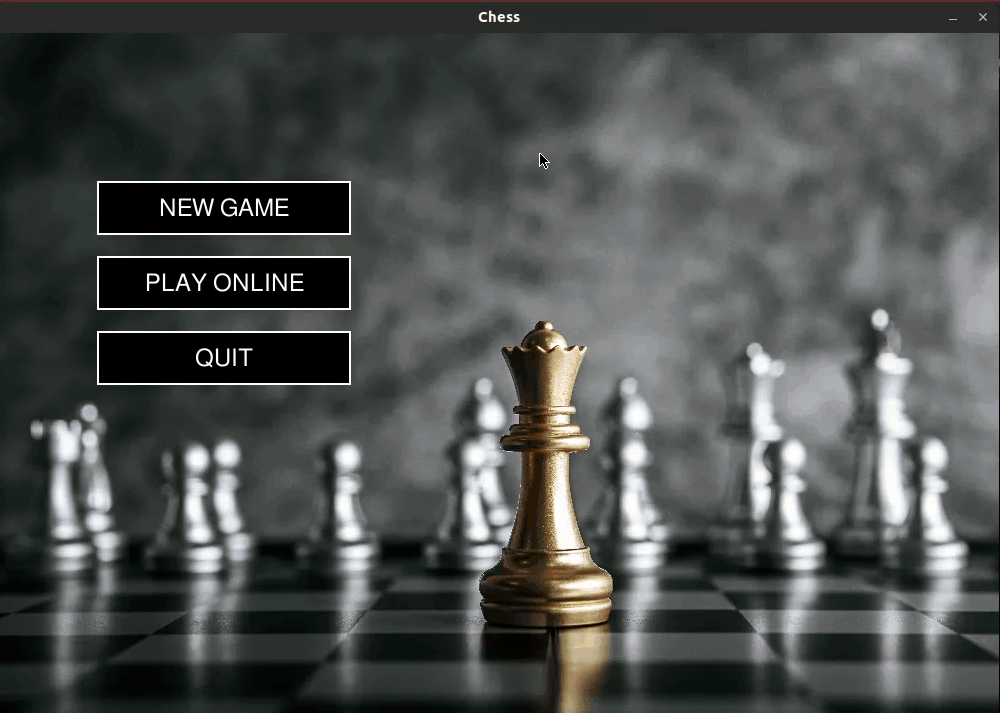

# Chess 

Chess game with AI ( implemented with minimax, with alpha-beta pruning ). This article helped me in creating the AI.  
[https://www.freecodecamp.org/news/simple-chess-ai-step-by-step-1d55a9266977/](https://www.freecodecamp.org/news/simple-chess-ai-step-by-step-1d55a9266977/)

For understanding minimax and alpha beta pruning this video was helpful for me.   
[Minimax & Alpha-beta pruning](https://youtu.be/l-hh51ncgDI)

The user could play either online by connecting to the server or with the AI.

To play the game, pygame is needed so install it, if you don't have it.
```
    $ pip install pygame
```
Then simply run game.py.
```
    $ python3 game.py
```



## Known Issues

* Stalemate
* Castling
* Pawn Promotion
* En Passant
* Timer

## Dependencies

* [Pygame](https://www.pygame.org/docs/)